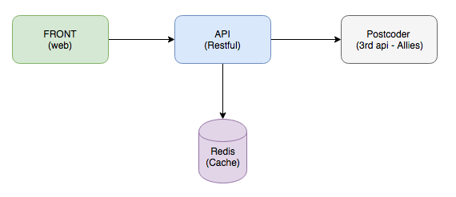

# FEXCO - Postcoder Search

This project is used to search at Postcoder API for Ireland and UK addresses.

### Architecture

The proprosal solution is divided in modules and micro services, with the same API options to garantee the maintenance of existing projects.

 - [API Module](api/README.md) - This module is responsible to communicate with 3rd API (Postcoder) caching all repeated results in redis cache.
 - [Front Module](front/README.md)  - This module is responsible by the front api to Test and see the results with a graphical way.
 - [Cache Module](redis/README.md)  - To avoid extra costs, all the repeated requests are stored in a Redis server. And this cache has to be available after server restart.

### Development Tools

- [IntelliJ](https://www.jetbrains.com/idea/)
- [Git Flow](https://danielkummer.github.io/git-flow-cheatsheet/index.html): Used to branch development flow.
- [GitHub Project](https://github.com/tuliocastro/postcode-fexco/projects) - To organize project tasks in a kanban way.

### How to Start the Environment
All modules is ready to run using docker images.

#### Requirements
- [Java 8](http://www.oracle.com/technetwork/java/javase/downloads/index.html)
- [Docker](https://docs.docker.com/engine/installation/)

> Docker host has to be set and daemon exposed. [Read more ...](https://docs.docker.com/engine/reference/commandline/dockerd/#bind-docker-to-another-hostport-or-a-unix-socket)

#### Building API Image

First we need to build and create the API Docker Image

    (cd api/ ; ./mvnw clean package docker:build) //Unix
    
    cd api && mvnw clean package docker:build //Windows
    
    
#### Running project (all modules)
Then, the other two modules is already ready to run, the docker compose will get the modules and run together. Just execute the following command:

    docker-compose up

### Access the running project

After these commands, the front project can be viewed at:

> [http://localhost:80](http://localhost:80)

The API Module is running at:

> [http://localhost:8080](http://localhost:8080)
   
 #### API Key example:
 
    PCWL6-NGHYB-8WMPH-K9X5B
