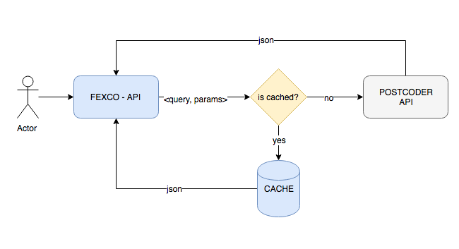

# FEXCO Postcoder API Module

This module is a RESTFUL API responsible to consume the Postcoder API and cache all queries that were alredy used.

## Frameworks

- Java 8
- Spring boot 
- Maven Wrapper
- Docker
- JUnit
- Spring Cache (Redis)

## How to Start

##### Execute Tests and Pack application

    $ ./mvnw clean build 
    
##### Create docker image

    $ ./mvnw package docker:build
    
##### Run docker image

    $ ./docker run -p 8080:8080 -t tuliocastro/postcoder-api

## Endpoints

All the endpoints is the same as Postcoder API, the main difference, is because this API cache the queries and results. The enpoints is following by the pattern:

    http://[host]:8080/[api-key]/[route]/[query]?params

- API_KEY: It's the Postcoder web API Key. This solution doesn't store any key. It has to be received.

> To get one, follow the sinup at Allies Computing. [In this link](https://www.alliescomputing.com/postcoder/sign-up).

- ROUTE: It's the lookup that you are looking for. It could be:
    
    - Irish address lookup: */address/ie/*
    - Irish address and coordinate lookup: */addressgeo/ie*
    - Coordinate lookup: */position/ie/*
    - Reverse geocode coordinates to an Irish address lookup: */rgeo/ie/*
    - (UK) Full premise-level address lookup - /address/uk/
    
    